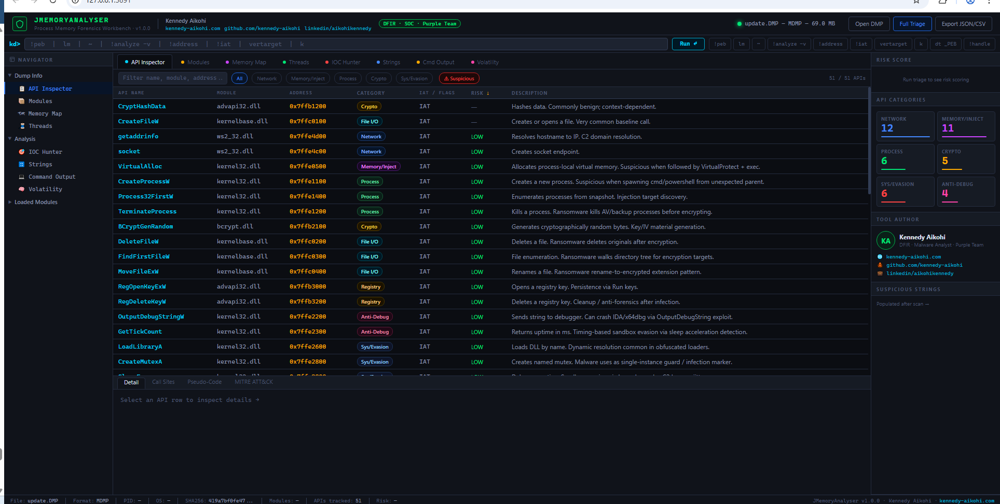

# JMemoryAnalyser v1.0.0

Memory Triage Engine and Browser-Based Forensics Workbench
For Windows Process Dumps (.DMP)

---

## Interface Preview



---

## Overview

JMemoryAnalyser is designed to answer a critical question in incident response:

What was this process doing in memory at the time of capture?

When a Windows process dump (.DMP) is collected, it contains a snapshot of:

* Loaded modules
* API imports and dynamically resolved functions
* Memory regions and protection flags
* Threads and execution context
* Strings and embedded indicators

JMemoryAnalyser parses and surfaces these artifacts to support rapid triage and investigation.

---

## Why JMAnalyser

In incident response, the most valuable evidence is often the first to disappear.

This tool was built to support the order of volatility by focusing on process memory, enabling analysts to quickly:

* Detect suspicious behavior
* Identify process injection patterns
* Reduce time to containment
* Support faster system recovery and business continuity

---

## What's New in v1.0.0

* Browser-based GUI workbench (Flask backend)
* API Inspector with categorized risk scoring
* Memory Map with RWX region detection
* IOC Hunter for rapid indicator extraction
* Improved minidump parsing engine
* Volatility integration support for extended analysis
* Enhanced CLI workflows for incident response pipelines

---

## GUI Workbench

Launch:

```powershell
.\scripts\Launch-JMA-GUI.ps1
```

Open in browser:

http://127.0.0.1:5891

### Panels

| Panel          | Description                                                         |
| -------------- | ------------------------------------------------------------------- |
| API Inspector  | Categorized APIs with risk scoring and dynamic resolution detection |
| Memory Map     | Full address space with RWX regions highlighted                     |
| IOC Hunter     | Extracted IPs, URLs, domains, named pipes, YARA hits                |
| Command Output | WinDbg-style command execution via CDB                              |
| Strings        | ASCII and UTF-16 string extraction and classification               |
| Modules        | Loaded modules with metadata                                        |
| Threads        | Thread enumeration                                                  |
| Risk Score     | Aggregated threat scoring                                           |

---

## CLI Usage

```powershell
# Basic triage
.\scripts\JMemoryAnalyser.ps1 -InputPath "dump.DMP" -Mode basic

# Minidump parsing
.\scripts\JMemoryAnalyser.ps1 -InputPath "dump.DMP" -Mode minidump

# Case triage
.\scripts\Invoke-JMA-CaseTriage.ps1 -CaseName "incident01" -Dumps "dump1.DMP","dump2.DMP"
```

---

## Key Capabilities

* API behavior analysis and risk scoring
* Detection of process injection techniques
* Identification of dynamically resolved APIs
* Memory inspection with RWX detection
* IOC extraction from memory
* YARA rule integration
* CDB (WinDbg) integration
* Volatility support for deeper analysis

---

## API Risk Scoring

| Score | Meaning                            |
| ----- | ---------------------------------- |
| 4     | High confidence malicious behavior |
| 3     | Strong indicator                   |
| 2     | Suspicious                         |
| 1     | Low relevance                      |
| 0     | Normal                             |

Dynamic resolution detection flags APIs resolved at runtime using:

* GetProcAddress
* LoadLibraryA

---

## Installation

```powershell
# Install environment
.\scripts\Install-JMA.ps1

# With YARA
.\scripts\Install-JMA.ps1 -WithYara

# Full setup
.\scripts\Install-JMA.ps1 -WithYara -WithMinidump
```

---

## YARA Rules

```powershell
.\scripts\Update-JMA-Rules.ps1
```

---

## Folder Structure

```
JMemoryAnalyser/
├── assets/
│   └── images/
├── scripts/
├── python/jma/
├── rules/
├── cases/
├── reports/
└── samples/
```

---

## Technical Notes

* Designed for Windows Task Manager dumps (MDMP format)
* Works offline with no telemetry
* UTF-16 string extraction supported
* JSON and CSV export supported
* CDB integration for advanced debugging
* Volatility integration for extended workflows

---

## Author

Kennedy Aikohi

https://kennedy-aikohi.com

https://github.com/kennedy-aikohi

https://linkedin.com/in/aikohikennedy

---

## Repository

https://github.com/kennedy-aikohi/JMemoryAnalyser

---

JMemoryAnalyser
Memory triage focused on detection, containment, and recovery
